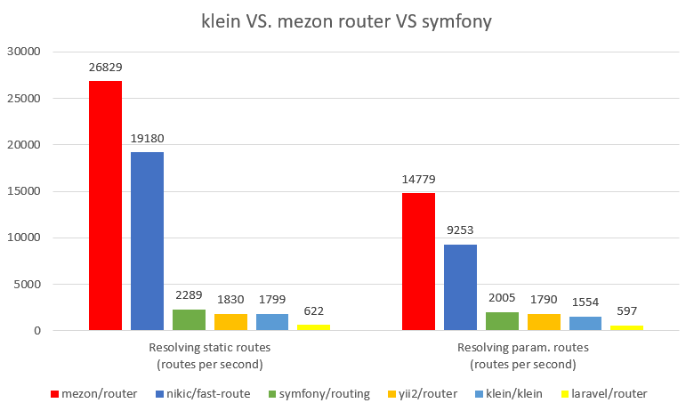

# Routing

[](https://travis-ci.com/alexdodonov/mezon-router) [](https://scrutinizer-ci.com/g/alexdodonov/mezon-router/?branch=master) [](https://codecov.io/gh/alexdodonov/mezon-router)

## Intro
Mezon provides simple routing class for your needs.

## Installation

Just print in console

```
composer require mezon/router
```

And that's all )

## Reasons to use

The mezon/router is 

- more than 25 times faster then klein/klein router;
- 7 to 15 times faster then Symfony router;
- 30 to 50 times faster then Laravel router;
- more then 1,5 times faster then nikic/fast-toute;



[mezon and klein comparison](doc/router.md)

[mezon and symfony comparison](doc/router-symfony.md)

[mezon and laravel comparison](doc/router-laravel.md)

[mezon and fast-route comparison](doc/fast-route.md)

[mezon and yii2 router comparison](doc/yii2.md)

# I'll be very glad if you'll press "STAR" button )

## Simple routes

Router allows you to map URLs on your php code and call when ever it needs to be called.

Router supports simple routes like in the example above - example.com/contacts/

Each Application object implicitly creates routes for it's 'action[action-name]' methods, where 'action-name' will be stored as a route. Here is small (as usual)) ) example:

```PHP
class           MySite
{
    /**
    *   Main page.
    */
    public function actionIndex()
    {
        return 'This is the main page of our simple site';
    }

    /**
    *   Contacts page.
    */
    public function actionContacts()
    {
        return 'This is the "Contacts" page';
    }

    /**
    *   Some custom action handler.
    */
    public function someOtherPage()
    {
        return 'Some other page of our site';
    }
    
    public static function someStaticMethod()
    {
        return 'Result of static method';
    }
}
```

And this code

```PHP
$router = new \Mezon\Router\Router();
$router->fetchActions( $mySite = new MySite() );
```

will create router object and loads information about it's actions and create routes. Strictly it will create two routes, because the class MySite has only two methods wich start with 'action[Suffix]'. Method 'someOtherPage' will not be converted into route automatically.

Then just call to run callback by URL:

```php
$router->callRoute('/other-page/');
```

You can manually specify callbacks for every URL in your application:

```PHP
$router->addRoute( '/some-any-other-route/' , [ $mySite , 'someOtherPage' ] );
```

And you also can use static methods:

```PHP
$router->addRoute( '/static-route/' , [ 'MySite' , 'someStaticMethod' ] );
// or in this way
$router->addRoute( '/static-route/' , 'MySite::someStaticMethod' );
```

We just need to create it explicitly.

We can also use simple functions for route creation:

```PHP
function        sitemap()
{
    return( 'Some fake sitemap' );
}

$router->addRoute( '/sitemap/' , 'sitemap' );
```

And you can find callback without launching it:

```php
$router->addRoute( '/static-route/' , 'MySite::someStaticMethod' );
$callback = $router->getCallback('/static-route/');
var_dump($callback());
```

## Supported request methods

Mezon Router supports: GET, POST, PUT, DELETE, OPTION

To get the list of these methods you can use method getListOfSupportedRequestMethods:

```php
$router = new \Mezon\Router\Router();
var_dump($router->getListOfSupportedRequestMethods());
```

## One handler for all routes

You can specify one processor for all routes like this:

```PHP
$router->addRoute( '/*/' , function(){} );
```

Note that routing search will stops if the '*' handler will be found. For example:

```PHP
$router->addRoute( '/*/' , function(){} );
$router->addRoute( '/index/' , function(){} );
```

In this example route /index/ will never be reached. All request will be passed to the '*' handler. But in this example:

```PHP
$router->addRoute( '/contacts/' , function(){} );
$router->addRoute( '/*/' , function(){} );
$router->addRoute( '/index/' , function(){} );
```

route /contacts/ will be processed by it's own handler, and all other routes (even /index/) will be processed by the '*' handler.

## Route variables

And now a little bit more complex routes:

```PHP
$router->addRoute( '/catalogue/[i:cat_id]/' , function( $route , $variables ){} );
$router->addRoute( '/catalogue/[a:cat_name]/' , function( $route , $variables ){} );
```

Here:

i - any integer number
a - any [a-z0-9A-Z_\/\-\.\@]+ string
il - comma separated list of integer ids
s - any string

Parameter name must consist of the following chars: [a-zA-Z0-9_\-] 

All this variables are passed as second function parameter wich is named in the example above - $variales. All variables are passed as an associative array.

## Request types and first steps to the REST API

You can bind handlers to different request types as shown bellow:

```PHP
$router->addRoute( '/contacts/' , function(){} , 'POST' ); // this handler will be called for POST requests
$router->addRoute( '/contacts/' , function(){} , 'GET' );  // this handler will be called for GET requests
$router->addRoute( '/contacts/' , function(){} , 'PUT' );  // this handler will be called for PUT requests
$router->addRoute( '/contacts/' , function(){} , 'DELETE' );  // this handler will be called for DELETE requests
$router->addRoute( '/contacts/' , function(){} , 'OPTION' );  // this handler will be called for OPTION requests
```

## Reverse routes

You can reverse routes and compile URLs by route's name. For example:

```php
$router = new \Mezon\Router\Router();
$router->addRoute('/some-route/[i:id]' , function(){} , 'GET' , 'name of the route');
// will output /some-route/123
var_dump($router->reverse('name of the route' , ['id' => 123]));
```

## Routes caching

Since version 1.1.0 you can cache routes on disk and read them from this cache.

To dump cache on disk use:

```php
$router->dumpOnDisk('./cache/cache.php');
```

And after that you can load routes:

```php
$router->loadFromDisk('./cache/cache.php');
```

But these methods have limitations - they can not dump and load closures because of obvious reasons

You can also worm cache without dumping:

```php
$router->warmCache();
```

## Middleware and model binding

You can register your own middleware wich will be called before the route handler will be executed. This middleware can transform common parameters $route and $parameters into something different.

Let's look at the example:

```php
$router = new Router();
$router->addRoute('/user/[i:id]', function(string $route, array $parameters){
    $userModel = new UserModel();
    $userObject = $userModel->getUserById($parameters[$id]);

    // use $userObject for any purpose you need
});
```

Quite simple, but you can register middleware wich will do all dirty job:

```php
$router = new Router();
$router->addRoute('/user/[i:id]', function(UserObject $userObject){
    // here we get $userObject directly
    // use use it in any way we need
});
$router->registerMiddleware('/user/[i:id]', function(string $route, array $parameters){
    $userModel = new UserModel();
    $userObject = $userModel->getUserById($parameters[$id]);
    return $userObject;
});
```

# Learn more

More information can be found here:

[Twitter](https://twitter.com/mezonphp)

[dev.to](https://dev.to/alexdodonov)

[Slack](https://join.slack.com/t/mezon-framework/signup?x=x-p1148081653955-1171709616688-1154057706548)