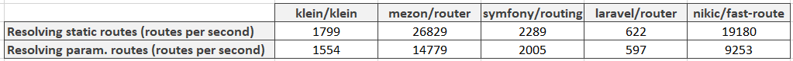
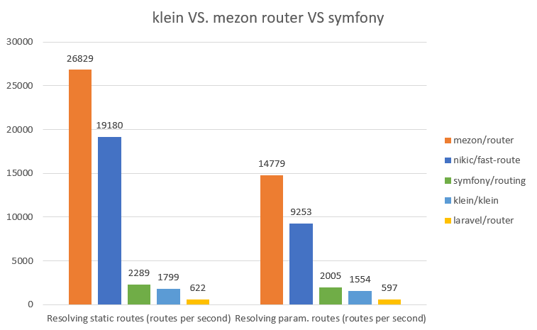

# Intro

Hello people! The time has come to find out does **nikic/fast-route** really fast? And is it faster then **mezon/router**?

Like in the previous articles we shall test static routes and routes with parameters in them.

Static routes we shall benchmark in this way:

```php
// repeat this in loop
$dispatcher = FastRoute\simpleDispatcher(function (FastRoute\RouteCollector $r) {
    $r->addRoute('GET', '/static', function () {
        return 'static';
    });
});
$routeInfo = $dispatcher->dispatch('GET', '/static');
$routeInfo[1]();
```

And routes with parameters will be benchmarked like this:

```php
// repeat this in loop also
$dispatcher = FastRoute\simpleDispatcher(function (FastRoute\RouteCollector $r) {
    $r->addRoute('GET', '/{id:\d+}', function () {
        return 'param';
    });
});
$routeInfo = $dispatcher->dispatch('GET', '/1');
$routeInfo[1]();
```

Results are definitely showing us that mezon/router is still the fastest router among the benchmarked ones.

In this table you can see amount of dispatched routes per second. So this means that the bigger number means better.





As you can see - mezon/touter is about 1,5 times faster than nikic/fast-route.

# What is mezon/router?

mezon/router now is:

- framework for routing with **100% code coverage**
- **10.0 points** at scrutinizer-ci.com
- router is a part of the [Mezon Project](https://github.com/alexdodonov/mezon)

Repo on github.com: https://github.com/alexdodonov/mezon-router

# I'll be very glad if you'll press "STAR" button )