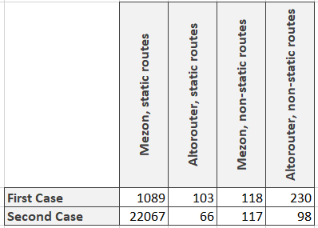

# Intro

Hello all! The time has come to benchmark Altorouter and compare it with the Mezon router.

As usual we have two cases:

1. http server accepts request, launches php script, wich handles this request, and then all script data uploads from memory. All following requests are processed in the same way. In this case very critical to launch script as soon as possible and we do not have time for long pre-compilations and preparations. Because all of it will be lost after the script will finish working;
2. php script is launching, initiating all internal components (and router is one of them) and then starting processing requests. This case can be organized via for example react-php. It differs from the previous case because we can spend reasonable time to pre-compile routes for faster processing.

# Changes in benchmark

Since the last benchmarks I have implemented routes caching. So our benchmark for the first will look like this:

```php
$router = \Mezon\Benchmark\RouteGenerator::generateMezonStaticRoutes(1000);
$router->dumpOnDisk();
$router->clear();

$startTime = microtime(true);
for ($i = 0; $i < \Mezon\Benchmark\Base::$iterationsAmount; $i ++) {
    $router->loadFromDisk();
    $router->callRoute('/static/' . rand(0, 1000 - 1));
}
return microtime(true) - $startTime;
```

As you can see we create the cache before benchmarking and then using it.

And for the Altorouter the URL initialization function will look like this:

```php
public static function generateAltorouterStaticRoutes(int $amount): \AltoRouter
{
    $router = new \AltoRouter();

    for ($i = 0; $i < $amount; $i ++) {
        $router->map('GET', '/static/' . $i, '\Mezon\Benchmark\staticCallback');
    }

    return $router;
}
```

The function for initialization non-static routes is alomost the same so I shall not spend your time on it.

And our benchmarks will be:

```php
// first case, static routes
for ($i = 0; $i < \Mezon\Benchmark\Base::$iterationsAmount; $i ++) {
    $router = \Mezon\Benchmark\RouteGenerator::generateAltorouterStaticRoutes(1000);

    $router->match('/static/' . rand(0, 1000 - 1))['target']();
}
```

And

```php
// second case, static routes also 
for ($i = 0; $i < \Mezon\Benchmark\Base::$iterationsAmount; $i ++) {
    $router->match('/static/' . rand(0, 1000 - 1));
}
```

The code for non-static routes is almost the same.

Let's see the results (the bigger numbers means better)!



As you can see Mezon router is up to 20 times faster then Altorouter almost in all cases. Only in one case Altorouter is faster.

# What is mezon/router?

mezon/router now is:

- framework for routing with **100% code coverage**
- **10.0 points** on scrutinizer-ci.com
- router is a part of the [Mezon Project](https://github.com/alexdodonov/mezon)

Repo on github.com: https://github.com/alexdodonov/mezon-router

# It will be great if you will contribute something to this project. Documentation, sharing the project in your social media, bug fixing, refactoring, or even **[submitting issue with question or feature request](https://github.com/alexdodonov/mezon-router/issues)**. Thanks anyway )