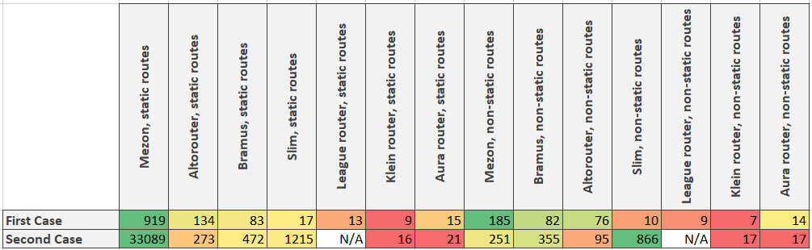

# Intro

Hi all! In this article we shall try to benchmark another php router - Aura Router.

As usual we have two cases:

1. http server accepts request, launches php script, wich handles this request, and then all script data uploads from memory. All following requests are processed in the same way. In this case very critical to launch script as soon as possible and we do not have time for long pre-compilations and preparations. Because all of it will be lost after the script will finish working;
2. php script is launching, initiating all internal components (and router is one of them) and then starting processing requests. This case can be organized via for example react-php. It differs from the previous case because we can spend reasonable time to pre-compile routes for faster processing.

# Benchmark principes

Here is our static routes generator

```php
public static function generateAuraStaticRoutes(int $amount): \Aura\Router\Matcher
{
    $router = new \Aura\Router\RouterContainer();
    $map = $router->getMap();

    for ($i = 0; $i < $amount; $i ++) {
        $map->get('static.'.$i, '/static/' . $i, '\Mezon\Benchmark\callbackPsr7Response');
    }

    return $router->getMatcher();
}
```

And here is the generator for non-static routes

```php
public static function generateAuraNonStaticRoutes(int $amount): \Aura\Router\Matcher
{
    $router = new \Aura\Router\RouterContainer();
    $map = $router->getMap();

    for ($i = 0; $i < $amount; $i ++) {
        $map->get('param' . $i, '/param/' . $i . '/{id}', '\Mezon\Benchmark\callbackPsr7Response');
    }

    return $router->getMatcher();
}
```

Here is our test for the first case:

```php
$_SERVER['REQUEST_METHOD'] = 'GET';

for ($i = 0; $i < \Mezon\Benchmark\Base::$iterationsAmount; $i ++) {
    $_SERVER['REQUEST_URI'] = '/static/' . rand(0, 1000 - 1);

    $request = \Zend\Diactoros\ServerRequestFactory::fromGlobals($_SERVER);

    $router = \Mezon\Benchmark\RouteGenerator::generateAuraStaticRoutes(1000);

    $route = $router->match($request);
    $route->handler($request);
}
```

And for the second case:

```php
$_SERVER['REQUEST_METHOD'] = 'GET';
$router = \Mezon\Benchmark\RouteGenerator::generateAuraStaticRoutes(1000);

for ($i = 0; $i < \Mezon\Benchmark\Base::$iterationsAmount; $i ++) {
    $_SERVER['REQUEST_URI'] = '/static/' . rand(0, 1000 - 1);
    $request = \Zend\Diactoros\ServerRequestFactory::fromGlobals($_SERVER);
    $route = $router->match($request);
    $route->handler($request);
}
```

# Results

 



**As you can see Mezon Router is at least 13 times faster then Aura Router in all cases.** Since the last release Mezon router was optimized for non-static routes processing. And the speed was increased up to 80%. And I shall do more in the next release )

# What is mezon/router?

mezon/router now is:

- framework for routing with **100% code coverage**
- **10.0 points** on scrutinizer-ci.com
- router is a part of the [Mezon Project](https://github.com/alexdodonov/mezon)

Repo on github.com: https://github.com/alexdodonov/mezon-router

# It will be great if you will contribute something to this project. Documentation, sharing the project in your social media, bug fixing, refactoring, or even **[submitting issue with question or feature request](https://github.com/alexdodonov/mezon-router/issues)**. Thanks anyway )