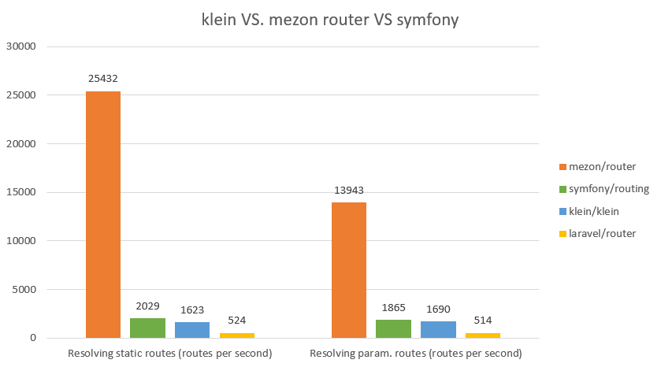

# Intro

Hello everybody! It is time to benchmark another well known router - Laravel router (to be precise - Illuminate\Routing).

Like in the previous articles we shall test static routes and routes with parameters in them.

Static routes we shall benchmark in this way:

```php
// repeat this in loop
with(new Illuminate\Routing\RoutingServiceProvider($app))->register();
$app['router']->get('/static', function () {
    return 'static';
});
$request = Illuminate\Http\Request::createFromGlobals();
$app['router']->dispatch($request);
```

And routes with parameters will be benchmarked like this:

```php
with(new Illuminate\Routing\RoutingServiceProvider($app))->register();
$app['router']->get('/{id}', function () {
    return 'param';
});
$request = Illuminate\Http\Request::createFromGlobals();
$app['router']->dispatch($request);
```

Results are quite astonishing (the bigger numbers means better)!




As you can see - Mezon router is 30 to 50 times faster than Laravel!!!

# What is mezon/router?

mezon/router now is:

- framework for routing with **100% code coverage**
- **10.0 points** on scrutinizer-ci.com

Repo on github.com: https://github.com/alexdodonov/mezon-router

# I'll be very glad if you'll press "STAR" button )