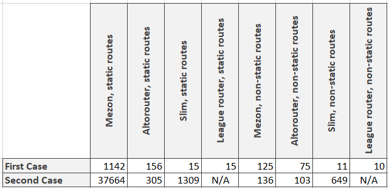

# Intro

Hi all! In this article we shall try to benchmark another php router - League Router.

As usual we have two cases:

1. http server accepts request, launches php script, wich handles this request, and then all script data uploads from memory. All following requests are processed in the same way. In this case very critical to launch script as soon as possible and we do not have time for long pre-compilations and preparations. Because all of it will be lost after the script will finish working;
2. php script is launching, initiating all internal components (and router is one of them) and then starting processing requests. This case can be organized via for example react-php. It differs from the previous case because we can spend reasonable time to pre-compile routes for faster processing.

# Benchmark principes

Here is our static routes generator

```php
public static function generateLeagueStaticRoutes(int $amount): \League\Route\Router
{
    $router = new \League\Route\Router();

    for ($i = 0; $i < $amount; $i ++) {
        $router->get('/static/' . $i, '\Mezon\Benchmark\staticCallbackPsr7Response');
    }

    return $router;
}
```

And here is the generator for non-static routes

```php
public static function generateLeagueNonStaticRoutes(int $amount): \League\Route\Router
{
    $router = new \League\Route\Router();

    for ($i = 0; $i < $amount; $i ++) {
        $router->get('/param/' . $i . '/{id}', '\Mezon\Benchmark\paramCallbackPsr7Response');
    }

    return $router;
}
```

Here is our test for the first case:

```php
$_SERVER['REQUEST_METHOD'] = 'GET';

for ($i = 0; $i < \Mezon\Benchmark\Base::$iterationsAmount; $i ++) {
    $_SERVER['REQUEST_URI'] = '/static/' . rand(0, 1000 - 1);

    $router = \Mezon\Benchmark\RouteGenerator::generateLeagueStaticRoutes(1000);

    $request = Laminas\Diactoros\ServerRequestFactory::fromGlobals($_SERVER, $_GET, $_POST, $_COOKIE, $_FILES);
    $router->dispatch($request);
}
```

And for the second case:

```php
$_SERVER['REQUEST_METHOD'] = 'GET';
$router = \Mezon\Benchmark\RouteGenerator::generateLeagueStaticRoutes(1000);

for ($i = 0; $i < \Mezon\Benchmark\Base::$iterationsAmount; $i ++) {
    $_SERVER['REQUEST_URI'] = '/static/' . rand(0, 1000 - 1);
    
    $request = Laminas\Diactoros\ServerRequestFactory::fromGlobals($_SERVER, $_GET, $_POST, $_COOKIE, $_FILES);
    $router->dispatch($request);
}
```

# Results

After the benchmark was launched it appears that League Router can not handle the second case. It tries to setup it's fast-route components while dispatch() call. And it does not clear the data after the previous call of the dispatch() method. It is a big surprise for me. But we still have data to analize. 



**As you can see Mezon Router is up to 76 times faster then League Router.**

# What is mezon/router?

mezon/router now is:

- framework for routing with **100% code coverage**
- **10.0 points** on scrutinizer-ci.com

Repo on github.com: https://github.com/alexdodonov/mezon-router

# I'll be very glad if you'll press "STAR" button on [Github](https://github.com/alexdodonov/mezon-router) )