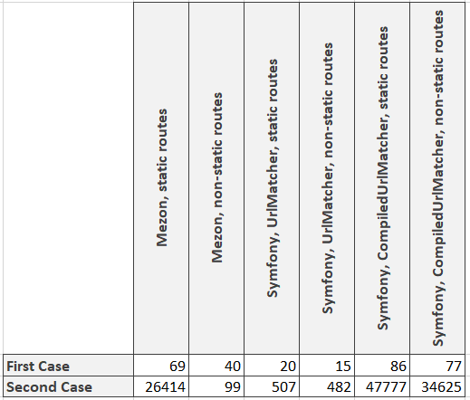

# Intro

Hi all! Since the [last article](https://dev.to/alexdodonov/real-life-comparison-of-symfony-router-and-mezon-router-1hb5) I have got some feedback. And the time has come to improve benchmark according to this feedback.

# Improvements

The author of the CompiledUrlMatcher Nikolas Grekas pointed on mistake in this case:

```php
for ($i = 0; $i < \Mezon\Benchmark\Base::$iterationsAmount; $i ++) {
    $staticRoutes = \Mezon\Benchmark\RouteGenerator::generateSymfonyStaticRoutes(1000);

    $dumper = new CompiledUrlMatcherDumper($staticRoutes);

    $requestContext = new RequestContext();
    $requestContext->fromRequest(Request::createFromGlobals());

    $staticMatcher = new CompiledUrlMatcher($dumper->getCompiledRoutes(), $requestContext);
    $staticMatcher->match('/static/' . rand(0, ROUTES_AMOUNT - 1))['controller']();
}
```

He have told that $dumper->getCompiledRoutes() should not be called in array. Very reasonable. So I have changed the benchmark and now it looks like this:

```php
// before the benchmark we shall compile routes and store them into cache
$staticRoutes = \Mezon\Benchmark\RouteGenerator::generateSymfonyStaticRoutes(1000);
$dumperStatic = new CompiledUrlMatcherDumper($staticRoutes);
file_put_contents(
    __DIR__ . '/../../../cache/static-cache.php',
    '<?php return ' . var_export($dumperStatic->getCompiledRoutes(), true) . ';');
```

And then we shall use this cache in the case:

```php
for ($i = 0; $i < \Mezon\Benchmark\Base::$iterationsAmount; $i ++) {
    $requestContext = new RequestContext();
    $requestContext->fromRequest(Request::createFromGlobals());

    $compiledRoutes = require __DIR__ . '/../../../cache/static-cache.php';

    $staticMatcher = new CompiledUrlMatcher($compiledRoutes, $requestContext);
    $staticMatcher->match('/static/' . rand(0, \Mezon\Benchmark\Base::$iterationsAmount - 1))['controller']();
}
```

# And what are the results? )



1. Mezon router is almost in all cases faster then Symfony's default UrlMatcher;
2. But if you agree to dig into Symfony's CompiledUrlMatcher - it will be the best choice. 

# What is mezon/router?

mezon/router now is:

- php framework for routing with **100% code coverage**
- **10.0 points** on scrutinizer-ci.com
- router is a part of the [Mezon Project](https://github.com/alexdodonov/mezon)

Repo on github.com: https://github.com/alexdodonov/mezon-router

# I'll be very glad if you'll press "STAR" button on [Github](https://github.com/alexdodonov/mezon-router) )