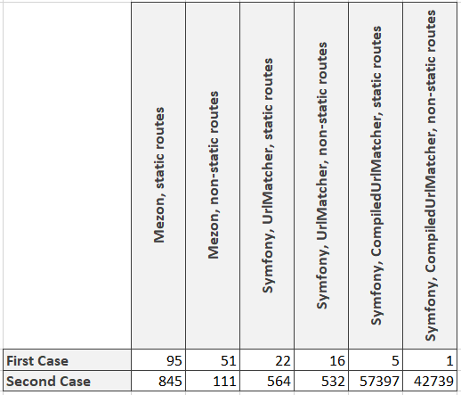

# Intro

Hello world! In my [previous article](https://dev.to/alexdodonov/new-php-router-wich-is-7-to-15-times-faster-then-symfony-router-2o5c) Nicolas Grekas noted that CompiledUrlMatcher (part of the Symfony framework) works better.

The time has come to benchmark it too )

To be honest it was quite tricky to do it, because Google don't give any documentation and tutorials about CompiledUrlMatcher But you are in better conditions - you can use this article as a tutorial if you will use this matcher.

# Benchmark concepts

Since now I have decided to change tests because in general we have two big cases:

1. http server accepts request, launches php script, wich handles this request, and then all script data uploads from memory. All following requests are processed in the same way. In this case very critical to launch script as soon as possible and we do not have time for long pre-compilations and preparations. Because all of it will be lost after the script will finish working.
2. php script is launching, initiating all internal components (and router is one of them) and then starting processing requests. This case can be organized via for example react-php. It differs from the previous case because we can spend reasonable time to pre-compile routes for faster processing

That's why I shall benchmark both of these cases.

In one group of tests all route objects will be re-created every loop. And in another group of tests time of initialization will outside the benchmarking code.

Let's start!

Here is benchmark for the static routes and as I said we take into consideration the time of creation of all router's structures and objects.

And by the way - we shall use 1000 routes here:

```php
for ($i = 0; $i < \Mezon\Benchmark\Base::$iterationsAmount; $i ++) {
    $staticRoutes = \Mezon\Benchmark\RouteGenerator::generateSymfonyStaticRoutes(1000);

    $dumper = new CompiledUrlMatcherDumper($staticRoutes);

    $requestContext = new RequestContext();
    $requestContext->fromRequest(Request::createFromGlobals());

    $staticMatcher = new CompiledUrlMatcher($dumper->getCompiledRoutes(), $requestContext);
    $staticMatcher->match('/static/' . rand(0, ROUTES_AMOUNT - 1))['controller']();
}
```

The benchmark for non-static routes is almost the same so I shall not put it here.

Let's see at the benchmark for the second case:

```php
// this code is not in the benchmark scope...
$staticRoutes = \Mezon\Benchmark\RouteGenerator::generateSymfonyStaticRoutes(1000);

$dumper = new CompiledUrlMatcherDumper($staticRoutes);

$requestContext = new RequestContext();
$requestContext->fromRequest(Request::createFromGlobals());

$staticMatcher = new CompiledUrlMatcher($dumper->getCompiledRoutes(), $requestContext);

$startTime = microtime(true);
// ... only this one
for ($i = 0; $i < \Mezon\Benchmark\Base::$iterationsAmount; $i ++) {
    $staticMatcher->match('/static/' . rand(0, ROUTES_AMOUNT - 1))['controller']();
}
echo microtime(true) - $startTime;
```

And the results are (the bigger numbers means better and the numbers are requests per second):




Here we can see:

1. Mezon router is still almost always faster then Symfony+UrlMatcher;
2. CompiledUrlMatcher is lightning fast (Nicolas Grekas have done great optimizations) for the second case, and terrible results for the first case. The reason of these results is hidden in the url matcher's optimizations - pre-compilation of routers takes very long time.

What is the conclusion? I am still sure that Mezon router is the best common purpose routing framework. But in some specialized cases you should use Symfony with the CompiledUrlMatcher.

# What is mezon/router?

mezon/router now is:

- php framework for routing with **100% code coverage**
- **10.0 points** on scrutinizer-ci.com
- router is a part of the [Mezon Project](https://github.com/alexdodonov/mezon)

Repo on github.com: https://github.com/alexdodonov/mezon-router

# I'll be very glad if you'll press "STAR" button )