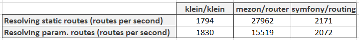

# Intro

Hi people! I want to continue the previous [article](https://dev.to/alexdodonov/new-php-router-is-25-times-faster-then-klein-router-4ap0) in wich I have compared mezon/router with the klein router.

And in this article I shall compare mezon router with the Symfony routing class.

# Benchmark for mezon/router

But now I have decided to change benchmark a little bit. Since now we shall take into consideration not only routing itself but also creation of the router object.

For example we shall benchmark not only this code:

```PHP
for ($i = 0; $i < $iterationCount1; $i ++) {
    $routerTest1->callRoute('/static');
}
```

But this one:

```php
for ($i = 0; $i < $iterationCount1; $i ++) {
    $routerTest1 = new \Mezon\Router\Router();
    $routerTest1->addRoute('/static', function () {
        return 'static';
    }, 'GET');
    $routerTest1->callRoute('/static');
}
```

# Benchmark for klein/klein

The same changes will be made for klein benchmark:

```php
for ($i = 0; $i < $iterationCount1; $i ++) {
    $routerTest1 = new \Klein\Klein();
    $routerTest1->respond('GET', '/static', function () {
        return 'static';
    });
    $routerTest1->dispatch(null,null,true,\Klein\Klein::DISPATCH_CAPTURE_AND_RETURN);
}
```

And:

```php
for ($i = 0; $i < $iterationCount2; $i ++) {
    $routerTest2 = new \Klein\Klein();
    $routerTest2->respond('GET', '/[i:id]', function () {
        return 'param';
    });
    $routerTest2->dispatch(null,null,true,\Klein\Klein::DISPATCH_CAPTURE_AND_RETURN);
}
```

# Benchmark for symfony routing

And now it is time to look at the symphony benchmark code:

```php
$iterationCount1 = 10000;
$startTime1 = microtime(true);
for ($i = 0; $i < $iterationCount1; $i ++) {
    $static = new Route('/static', [
        'controller' => function () {
            return 'static';
        }
    ]);
    $staticRoutes = new RouteCollection();
    $staticRoutes->add('static', $static);

    $staticContext = new RequestContext();
    $staticContext->fromRequest(Request::createFromGlobals());

    $staticMatcher = new UrlMatcher($staticRoutes, $staticContext);
    $parameters = $staticMatcher->match('/static');
    $parameters['controller']();
}
$endTime1 = microtime(true);
```

And for URLs with parameters:

```php
$iterationCount2 = 10000;
$startTime2 = microtime(true);
for ($i = 0; $i < $iterationCount2; $i ++) {
    $param = new Route('/{id}', [
        'controller' => function () {
            return 'param';
        },
        [
            'id' => '[0-9]+'
        ]
    ]);

    $paramRoutes = new RouteCollection();
    $paramRoutes->add('param', $param);

    $paramContext = new RequestContext();
    $paramContext->fromRequest(Request::createFromGlobals());

    $paramMatcher = new UrlMatcher($paramRoutes, $paramContext);
    $paramMatcher->match('/1')['controller']();
}
$endTime2 = microtime(true);

```

And the results are (the bigger numbers means better):




As you can see - Mezon router is 7 to 15 times faster than Symfony router.

# What is mezon/router?

mezon/router now is:

- framework for routing with **100% code coverage**
- **10.0 points** on scrutinizer-ci.com
- router is a part of the [Mezon Project](https://github.com/alexdodonov/mezon)

Repo on github.com: https://github.com/alexdodonov/mezon-router

# I'll be very glad if you'll press "STAR" button )