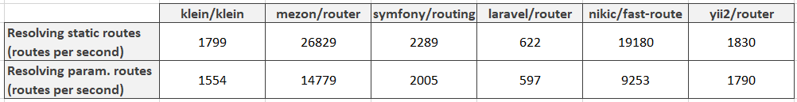

# Intro

Hello people! This article is a new one in a series of my benchmarking experiments. And today we shall find out what's the difference in performance of Yii2 router and mezon/router.

Like in the previous articles we shall test static routes and routes with parameters in them.

But before it we have to define the most primitive controller:

```php
<?php
namespace console\controllers;

use yii\web\Controller;

// minimum possible functionality
class BenchmarkController extends Controller
{

    public function actionStatic(): string
    {
        return 'static';
    }

    public function actionParam(): string
    {
        return 'param';
    }
}
```

Then we need to configure route with parameter:

```php
// somewere in main.php
'components' => [
    // other staff here
    
    // and our setup
    'urlManager' => [
        'enablePrettyUrl' => true,
        'showScriptName' => false,
        'rules' => [
            // our route with parameter
            'benchmark/<id:\d>' => 'benchmark/param'
        ],
    ]
]
```

Static routes will be benchmarked in this way:

```php
<?php
// it's is normal Yii mess, don't panic )))
defined('YII_DEBUG') or define('YII_DEBUG', false);
defined('YII_ENV') or define('YII_ENV', 'production');

require __DIR__ . '/../vendor/autoload.php';
require __DIR__ . '/../vendor/yiisoft/yii2/Yii.php';
require __DIR__ . '/../common/config/bootstrap.php';
require __DIR__ . '/config/bootstrap.php';

$config = yii\helpers\ArrayHelper::merge(require __DIR__ . '/../common/config/main.php', require __DIR__ . '/../common/config/main-local.php', require __DIR__ . '/config/main.php', require __DIR__ . '/config/main-local.php');

$app = new yii\web\Application($config);

// here we try to launch our console script as it was called in web
$_SERVER['REQUEST_URI'] = '/yii2/yii2-app-advanced/console/test.php/benchmark/static';
$_SERVER['REQUEST_METHOD'] = 'GET';
$_SERVER['PHP_SELF'] = '/benchmark/static';
$_SERVER['SCRIPT_NAME'] = '/yii2/yii2-app-advanced/console/test.php';

// and here our benchmark itself
$iterationsCount = 10000;
$start = microtime(true);
for ($i = 0; $i < $iterationsCount; $i ++) {
    $request = new yii\web\Request();
    $app->handleRequest($request);
}
print($iterationsCount / (microtime(true) - $start));
```

And routes with parameters will be benchmarked like this:

```php
// some variations from the previous benchmark
$_SERVER['REQUEST_URI'] = '/yii2/yii2-app-advanced/console/test.php/benchmark/1';
$_SERVER['PHP_SELF'] = '/benchmark/1';
```

The loop in wich we run $app->handleRequest($request) will be the same.

In this table you can see amount of dispatched routes per second. So this means that the bigger number means better. And for an all purpose framework the result is not bad. But mezon/router is faster )))




As you can see - mezon/touter is from 24 to 43 times faster than Yii2 router.

# What is mezon/router?

mezon/router now is:

- framework for routing with **100% code coverage**
- **10.0 points** at scrutinizer-ci.com

Repo on github.com: https://github.com/alexdodonov/mezon-router

# I'll be very glad if you'll press "STAR" button )