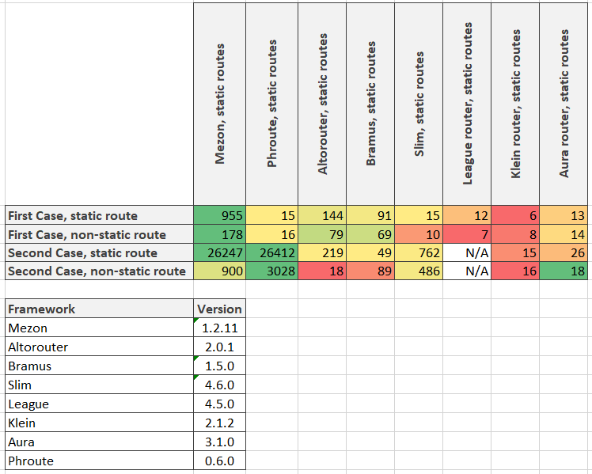

# Intro

Hello all! The time I shall compare Phroute with Mezon Router.

As usual we have two cases:

1. http server accepts request, launches php script, which handles this request, and then all script data uploads from memory. All following requests are processed in the same way. In this case very critical to launch script as soon as possible and we do not have time for long pre-compilations and preparations. Because all of it will be lost after the script will finish working;
2. php script is launching, initiating all internal components (and router is one of them) and then starting processing requests. This case can be organized via for example react-php. It differs from the previous case because we can spend reasonable time to pre-compile routes for faster processing.

# First case

```php
// static routes
for ($i = 0; $i < \Mezon\Benchmark\Base::$iterationsAmount; $i ++) {
    $router = \Mezon\Benchmark\RouteGenerator::generatePhrouteStaticRoutes(1000);

    $router->dispatch('GET', parse_url('/static/' . rand(0, 1000 - 1), PHP_URL_PATH));
}
```

```php
// non-static routes
for ($i = 0; $i < \Mezon\Benchmark\Base::$iterationsAmount; $i ++) {
    $router = \Mezon\Benchmark\RouteGenerator::generatePhrouteNonStaticRoutes(1000);

    $router->dispatch('GET', parse_url('/param/' . rand(0, 1000 - 1) . '/1', PHP_URL_PATH));
 }
```

# Second case

```php
// static routes
$router = \Mezon\Benchmark\RouteGenerator::generatePhrouteStaticRoutes(1000);

$startTime = microtime(true);
for ($i = 0; $i < \Mezon\Benchmark\Base::$iterationsAmount; $i ++) {
    $router->dispatch('GET', parse_url('/static/' . rand(0, 1000 - 1), PHP_URL_PATH));
}
return microtime(true) - $startTime;
```

```php
// non-static routes
$router = \Mezon\Benchmark\RouteGenerator::generatePhrouteNonStaticRoutes(1000);

$startTime = microtime(true);
for ($i = 0; $i < \Mezon\Benchmark\Base::$iterationsAmount; $i ++) {
    $router->dispatch('GET', parse_url('/param/' . rand(0, 1000 - 1) . '/1', PHP_URL_PATH));
}
return microtime(true) - $startTime;
```

# Results



As you can see Mezon router is almost in all cases is faster then Phroute.

# What is mezon/router?

mezon/router now is:

- framework for routing with **100% code coverage**
- **10.0 points** on scrutinizer-ci.com
- router is a part of the [Mezon Project](https://github.com/alexdodonov/mezon)

Repo on github.com: https://github.com/alexdodonov/mezon-router

# It will be great if you will contribute something to this project. Documentation, sharing the project in your social media, bug fixing, refactoring, or even **[submitting issue with question or feature request](https://github.com/alexdodonov/mezon-router/issues)**. Thanks anyway )